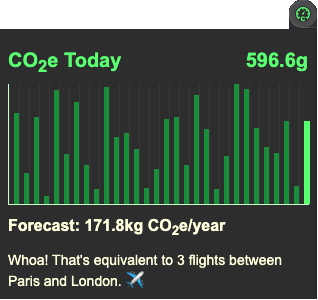

# Carbon Meter (web browser extension)

*Track carbon emissions resulting from your daily web browsing.*

## Why?

The web is a big consumer of energy and today most of that energy comes from the burning of fossil fuels. On average, a single page view generates 1.76g1 of carbon emissions or equivalent greenhouse gases.

This extension keeps track of the estimated carbon emitted (based on averages) while you are browsing around the web. Watch how quickly it all adds up!

1 Average carbon emissions per page view according to [Website Carbon Calculator](https://www.websitecarbon.com/) as of March 24, 2021.

Once installed and running for a bit, it looks like this:

## Local installation

This extension has been submitted to the [Chrome Web Store](https://chrome.google.com/webstore/category/extensions) and is currently under review. You can still install the extension in Developer mode by pulling down this code repo and installing `src` directory as an [unpacked extension](https://developer.chrome.com/docs/extensions/mv3/getstarted/).

## Acknowledgment

This extension was inspired when [Dryden Williams](https://www.drydenwilliams.co.uk/) recently posed the following 2 questions to the [ClimateAction.tech](https://climateaction.tech/) community.

> How many web pages do I visit per day?
>
> And how much CO2 per year this accounts for? (it's in tonnes)
